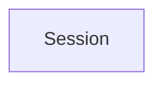

# Council Session: World-class repo hardening

Generated from `.agent-kit/council-sessions/2026-07-02-world-class-repo-hardening/events.jsonl` at 2026-07-02T13:27:54.429Z.

## Current State

- Session: 2026-07-02-world-class-repo-hardening
- Workflow: core-change
- Status: complete
- Active agent: lead-architect
- Next agent: none
- Quality target: baseline-setup
- Request: Implement world-class repo improvement plan: dogfood kit into root, real update semantics, packaging cleanup, lint and format, CI matrix, coverage, changesets, CLI UX, publish prep, docs site.

## Handoff Graph

## Decisions

| Agent | Decision | Risk | Evidence |
| --- | --- | --- | --- |
| lead-architect | Dogfood kit into repo root; hash-aware update; lint/format/coverage gates; CI matrix; changesets; human-first CLI output with --json contract. | Template conflicts will surface here first |  |

## Human Corrections

| Scope | Agent | Correction | Durable Rule |
| --- | --- | --- | --- |
| None | None | None recorded | None |

## Required Outputs

| Output | Status | Evidence |
| --- | --- | --- |
| architecture decision | complete | DECISIONS.md ADRs 2026-07-02: dogfood root install, hash-aware update semantics, hygiene baseline, human-first CLI output. |
| maturity evidence | complete | Repo audit passes with 63 checks; QUALITY_GATES.md and DOGFOOD.md updated with 2026-07-02 evidence. |
| security review | complete | npm audit clean; SBOM validated; no new deps with CVEs; update command constrained by resolveInside path guards. |
| test evidence | complete | npm run release:check passed: typecheck, lint, format, coverage-gated tests, install smoke, studio smoke, pack dry run. |
| doc updates | complete | DECISIONS.md, DOCS.md, SPEC.md, README.md, DOGFOOD.md, UPGRADE.md, DEPLOYMENT.md, MESSAGING.md, DESIGN.md, docs/ site updated. |
| upgrade evidence when applicable | complete | UPGRADE.md records hash-aware update flow; tests/update.test.ts covers pristine auto-update, conflict, force, dry-run. |
| release or rollback notes | complete | Changeset .changeset/world-class-hardening.md staged; DEPLOYMENT.md documents npm Trusted Publishing release and rollback. |
| visual QA evidence | not-applicable | CLI-only change; output verified via CLI contract tests. |
| security review evidence | complete | npm audit clean; SBOM validated; no new dependencies with CVEs; update command uses resolveInside path guards. |

## Artifacts

- src/install/update.ts - Hash-aware update semantics with dry-run
- src/cli/index.ts - Human-first CLI output, --json and --dry-run everywhere, guided init, error boundary

## Verification

| Command | Result | Notes |
| --- | --- | --- |
| npm run release:check | pass | Full gate: json validation, version check, typecheck, lint, format, coverage tests, build, example check, install smoke, studio smoke, npm audit, SBOM, pack dry run. |

## Next Actions

- None recorded.

