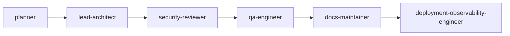

# Council Session: leading-harness-implementation

Generated from `.agent-kit/council-sessions/2026-07-11-leading-harness-implementation/events.jsonl` at 2026-07-11T03:04:32.271Z.

## Current State

- Session: 2026-07-11-leading-harness-implementation
- Workflow: core-change
- Status: complete
- Active agent: deployment-observability-engineer
- Next agent: deployment-observability-engineer
- Quality target: baseline-setup
- Request: Implement the approved Leading Harness Hardening and Runtime Orchestration plan.

## Handoff Graph

## Decisions

| Agent | Decision | Risk | Evidence |
| --- | --- | --- | --- |
| planner | Implement in releasable phases: release integrity, local security/durability, audit contracts, then optional LangGraph runtime. Preserve the lightweight baseline package and all existing user-owned/untracked files. |  |  |
| planner -&gt; lead-architect | Release, Studio, install, and audit contracts are hardened and focused tests pass. | The new orchestration runtime expands dependency and execution surface; keep it optional and fail closed. | npx vitest run focused suites: 66 audit/CLI/readiness tests and 52 Studio tests passed |
| lead-architect | Ship executable orchestration as a separate optional package, compile validated roster workflows to checkpointed LangGraph nodes, and preserve the root kit as the policy and evidence plane. | Optional runtime dependencies and host-capable tools increase supply-chain and execution risk; the baseline remains runtime-free and every mutation stays bounded by config, approval, worktree, and Docker policy. |  |
| lead-architect -&gt; security-reviewer | Review credential references, localhost APIs, outbound network policy, MCP allowlists, path boundaries, process cancellation, sandboxing, and release provenance. | Provider and host integrations remain security-sensitive and require explicit operator configuration. | packages/runtime/src/security, src/studio/local-http-security.ts, SECURITY.md |
| security-reviewer -&gt; qa-engineer | Security boundaries accepted with regression coverage for CSRF, redirects, private networks, secret redaction, traversal, cancellation, Docker controls, and package-source scanning. | Live provider credentials and external MCP systems remain operator-owned integration risk. | tests/runtime-security.test.ts, tests/runtime-provider.test.ts, tests/studio-serve.test.ts |
| qa-engineer -&gt; docs-maintainer | Behavioral, coverage, smoke, package, SBOM, and responsive browser evidence satisfy the implementation gate. | Registry publication and Trusted Publisher configuration still require live workflow verification. | npm run test:coverage, npm run smoke:install, browser QA 1440x900 and 390x844 |
| docs-maintainer -&gt; deployment-observability-engineer | Root/template docs, schemas, adapters, release runbooks, roadmap, changelog, and package guides reflect the optional runtime and two-package release. | A partial npm publication must not create a GitHub release. | RUNTIME_ORCHESTRATION_SCOPE.md, PUBLISH.md, SUPPLY_CHAIN.md, .github/workflows/release.yml |

## Human Corrections

| Scope | Agent | Correction | Durable Rule |
| --- | --- | --- | --- |
| None | None | None recorded | None |

## Required Outputs

| Output | Status | Evidence |
| --- | --- | --- |
| architecture decision | complete | DECISIONS.md and RUNTIME_ORCHESTRATION_SCOPE.md |
| maturity evidence | complete | Audit v2, manifest v2, coverage gate, package smokes, SBOMs, and browser QA. |
| security review | complete | SECURITY.md and runtime security/provider/Studio tests. |
| test evidence | complete | 194 tests and passing coverage thresholds. |
| doc updates | complete | Root and installed-template living docs updated. |
| upgrade evidence when applicable | complete | UPGRADE.md and hash-aware manifest v2 update tests. |
| release or rollback notes | complete | PUBLISH.md, DEPLOYMENT.md, SUPPLY_CHAIN.md, and two-package release workflow. |

## Artifacts

- None recorded.

## Verification

| Command | Result | Notes |
| --- | --- | --- |
| npm test | pass | 18 files and 150 tests passed with loopback permission; sandbox-only EPERM reproduced without it. |
| npm run test:coverage | pass | 194 tests passed; 80.04% statements, 66.78% branches, 84.43% functions, and 83.77% lines. |
| Agent Studio responsive browser QA | pass | Runs view verified at 1440x900 and 390x844 with no overlap or overflow; mobile controls precede canvas; disabled and empty states are explicit. |
| npm run release:check | pass | Full local release gate passed after example refresh, including coverage, build, package/adapters, examples, clean install, Studio/setup/audit smokes, dependency audit, SBOM, and both pack dry-runs. |

## Next Actions

- Continue with deployment-observability-engineer.
