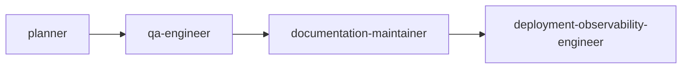

# Council Session: Publish README rewrite as root package 0.2.1

Generated from `.agent-kit/council-sessions/2026-07-11-publish-readme-rewrite-as-root-package-0-2-1-a69dc1ff/events.jsonl` at 2026-07-11T05:22:37.693Z.

## Current State

- Session: 2026-07-11-publish-readme-rewrite-as-root-package-0-2-1-a69dc1ff
- Workflow: release
- Status: complete
- Active agent: deployment-observability-engineer
- Next agent: deployment-observability-engineer
- Quality target: baseline-setup
- Request: Publish README rewrite as root package 0.2.1

## Handoff Graph

## Decisions

| Agent | Decision | Risk | Evidence |
| --- | --- | --- | --- |
| planner | Release a root-only patch because the public README changed while executable behavior and the runtime package remain unchanged. | A version mismatch or stale tarball could leave npm showing the old instructions. |  |
| planner -&gt; qa-engineer | Verify version consistency, packed README content, and the complete release gate. | Publishing before registry and tarball verification would expose stale documentation. | README.md, tests/public-readiness.test.ts, .changeset/verified-readme-examples.md |
| qa-engineer -&gt; documentation-maintainer | Release gate passed and generated example fixtures were refreshed for package 0.2.1. | Registry publication and GitHub Release still require post-push verification. | npm run release:check, examples/next-supabase-installed/.agent-kit/manifest.json, examples/next-supabase-installed/audit-output.json |
| documentation-maintainer -&gt; deployment-observability-engineer | Root package 0.2.1 changelog, version metadata, and README release scope are ready for Trusted Publishing. | Do not publish runtime 0.1.3 again; verify the root dist-tag after workflow completion. | CHANGELOG.md, package.json, package-lock.json, src/config/defaults.ts, README.md |

## Human Corrections

| Scope | Agent | Correction | Durable Rule |
| --- | --- | --- | --- |
| None | None | None recorded | None |

## Required Outputs

| Output | Status | Evidence |
| --- | --- | --- |
| decision | complete | Release only @appsforgood/next-supabase-kit as patch 0.2.1; @appsforgood/agent-kit-runtime remains 0.1.3 because its package contents did not change. |
| risk | complete | Mitigated stale fixture and tarball risks by refreshing installed examples and passing the full release gate and npm pack dry runs. |
| verification evidence | complete | Local release gate passed; Trusted Publishing run 29141026302 succeeded; npm latest is root 0.2.1 and runtime 0.1.3; published README and GitHub release v0.2.1 were independently verified. |

## Artifacts

- DOGFOOD.md

## Verification

| Command | Result | Notes |
| --- | --- | --- |
| npm run release:check | pass | Full gate passed: 200 tests, coverage thresholds, build, package/adapters/examples/install/studio/setup/audit checks, zero vulnerabilities, SBOM validation, and root/runtime pack dry runs. |
| npm view @appsforgood/next-supabase-kit@0.2.1 version dist-tags.latest --json | pass | Public npm registry reports version 0.2.1 and latest 0.2.1; the published README contains the verified task-oriented examples. |
| npm view @appsforgood/agent-kit-runtime version dist-tags.latest --json | pass | Runtime remains at unchanged version 0.1.3 and was correctly skipped by the release workflow. |
| gh release view v0.2.1 | pass | Public GitHub release v0.2.1 targets commit 12e0ea58c8fec4e0b0e676469e894044e7763ee6 after registry verification. |

## Next Actions

- Continue with deployment-observability-engineer.
