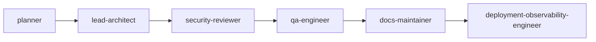

# Council Session: Make GitHub Actions opt-in by default

Generated from `.agent-kit/council-sessions/2026-07-25-make-github-actions-opt-in-by-default-32a2b568/events.jsonl` at 2026-07-25T02:04:54.295Z.

## Current State

- Session: 2026-07-25-make-github-actions-opt-in-by-default-32a2b568
- Workflow: core-change
- Status: in-progress
- Active agent: lead-architect
- Next agent: deployment-observability-engineer
- Quality target: baseline-setup
- Request: Make GitHub Actions opt-in by default

## Handoff Graph

## Decisions

| Agent | Decision | Risk | Evidence |
| --- | --- | --- | --- |
| planner -&gt; lead-architect | Treat hosted Actions as optional infrastructure and preserve local gates. | Existing protected branches may still require repository-settings changes. | src/install/install.ts, QUALITY_GATES.md |
| lead-architect -&gt; security-reviewer | Use an opt-in managed workflow with legacy upgrade handling. | Optional workflow dependencies and action references require supply-chain review. | templates/next-supabase/.github/workflows/agent-kit-audit.yml |
| security-reviewer -&gt; qa-engineer | Approve after immutable action pins, exact scoped CLI version, no project lifecycle scripts, and off/advisory-only modes. | Hosted OIDC publishing still requires working GitHub Actions entitlement. | tests/public-readiness.test.ts, templates/next-supabase/TESTING.md |
| qa-engineer -&gt; docs-maintainer | Focused tests and the full local release gate pass. | The first sandboxed release-gate attempt failed because localhost bind was denied; the approved unrestricted rerun passed. | 205 tests passed, npm run release:check |
| docs-maintainer -&gt; deployment-observability-engineer | Living docs and generated examples now define local-first verification and optional hosted CI. | Existing downstream repositories must update their Agent Kit assets or adjust repository settings manually. | DECISIONS.md, DEPLOYMENT.md, examples/next-supabase-installed/.agent-kit/config.json |
| lead-architect | Fresh installs keep GitHub Actions off; explicit opt-in installs a guarded advisory workflow; local verification remains authoritative; existing workflows are never silently deleted. | Existing downstream repositories still require their own workflow/config migration and repository settings must not require unavailable checks. |  |

## Human Corrections

| Scope | Agent | Correction | Durable Rule |
| --- | --- | --- | --- |
| None | None | None recorded | None |

## Required Outputs

| Output | Status | Evidence |
| --- | --- | --- |
| architecture decision | complete | DECISIONS.md 2026-07-25 ADR |
| maturity evidence | complete | Full local release gate passed; generated install audit has zero failures. |
| security review | complete | Pinned actions, exact scoped package, read-only permissions, no downstream lifecycle scripts or secrets. |
| test evidence | complete | 45 focused tests and 205 full-suite tests passed. |
| doc updates | complete | README, SPEC, DECISIONS, DOCS, QUALITY_GATES, TESTING, DEPLOYMENT, REPOSITORY_SETTINGS, SUPPLY_CHAIN, and installed templates updated. |
| upgrade evidence when applicable | complete | Legacy pristine workflows receive the advisory guard; explicit off preserves existing YAML; regression tests cover both. |
| release or rollback notes | complete | Changeset added; local gate is authoritative; npm OIDC release remains explicitly Actions-dependent. |

## Artifacts

- None recorded.

## Verification

| Command | Result | Notes |
| --- | --- | --- |
| npx vitest run tests/ide-activate.test.ts tests/update.test.ts tests/public-readiness.test.ts | pass | 45 tests passed. |
| node scripts/refresh-examples.mjs | pass | Example audit: 71 pass, 5 warn, 0 fail; readiness baseline-setup. |
| npm run release:check | pass | Unrestricted rerun passed: 22 files, 205 tests, coverage thresholds, build, validation, examples, install/Studio/setup/audit smokes, SBOM, audit, and package dry runs. |

## Next Actions

- Continue with deployment-observability-engineer.
