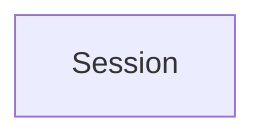

# Council Session: Release 0.3.0

Generated from `.agent-kit/council-sessions/2026-07-25-release-0-3-0-08eb334b/events.jsonl` at 2026-07-25T02:16:50.564Z.

## Current State

- Session: 2026-07-25-release-0-3-0-08eb334b
- Workflow: release
- Status: in-progress
- Active agent: deployment-observability-engineer
- Next agent: none
- Quality target: baseline-setup
- Request: Release 0.3.0

## Handoff Graph

## Decisions

| Agent | Decision | Risk | Evidence |
| --- | --- | --- | --- |
| deployment-observability-engineer | Publish only @appsforgood/next-supabase-kit@0.3.0; runtime remains 0.1.3 because it did not change. | GitHub Actions billing prevents the normal OIDC publish path; maintainer-local npm authentication and OTP are required. |  |

## Human Corrections

| Scope | Agent | Correction | Durable Rule |
| --- | --- | --- | --- |
| None | None | None recorded | None |

## Required Outputs

| Output | Status | Evidence |
| --- | --- | --- |
| decision | complete | Root package 0.3.0 only; runtime 0.1.3 unchanged. |
| risk | complete | Maintainer-local recovery required because hosted Actions billing blocks OIDC. |
| verification evidence | complete | npm run release:check passed for 0.3.0. |

## Artifacts

- None recorded.

## Verification

| Command | Result | Notes |
| --- | --- | --- |
| npm run release:check | pass | Versioned 0.3.0 gate passed: 205 tests plus build, validation, examples, smokes, SBOM, audit, and pack checks. |

## Next Actions

- None recorded.
