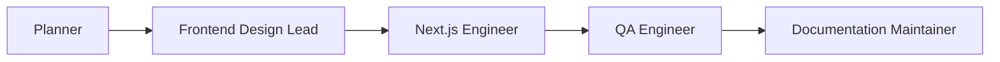

# Agent Studio Plan

This plan defines the local-first onboarding, council-session, correction, and Markdown observability layer for Agent Kit.

The goal is to make installed agents useful quickly, make their collaboration inspectable, and let the user correct project or agent behavior without requiring a database, hosted service, or separate AI API.

## Executive Summary

Agent Kit should add a Markdown-first "Agent Studio" workflow on top of the existing roster, skills, assistant adapters, and audit system.

The first version should not be a full autonomous multi-agent runtime. It should be a local protocol that IDE agents can use:

- Capture project context during install or onboarding.
- Record council-session events as append-only JSONL.
- Render those events into Markdown with Mermaid graphs.
- Persist human corrections as scoped local rules.
- Teach Codex, Claude Code, Cursor, OpenCode, and Copilot-style agents to read those files before acting.
- Audit whether the context, corrections, and active session evidence are present.

The implementation should use only the existing Node CLI plus local files.

Current Markdown-first V1 status:

- Implemented: schemas, local context scan/render/validate, guided install, session event logging, Markdown rendering, static HTML export, correction lifecycle commands, adapter guidance, audit checks, fixture tests, example snapshots, and `npm run smoke:studio`.
- Release-gated: `npm run release:check` runs the Agent Studio smoke path.
- Still future: live local GUI/canvas view and direct AI API orchestration.

## Core Decision

Use JSON/JSONL as the source of truth and Markdown as the primary interface.

Do not require:

- SQLite
- A hosted database
- A background daemon
- Cloud storage
- A separate model API key
- A web server for baseline usage

Optional later UI can be generated from the same files.

## Design Principles

### Local First

All state lives in the downstream project under `.agent-kit/`. The user can inspect, commit, diff, revert, or delete it with normal Git workflows.

### Agent Assisted, Not API Required

The installed IDE/chat agent is the actor that updates files after user feedback. The kit supplies the file contracts, CLI helpers, adapter instructions, renderers, and audit checks.

Direct OpenAI, Anthropic, or other model API orchestration is a later optional mode, not the baseline assumption.

### Markdown Readability

Every important state should have a readable Markdown representation. Users should not have to inspect raw JSON to understand what happened.

### Structured Enough To Audit

Machine-readable files should have JSON Schema contracts. Audit should catch missing context, malformed sessions, unrendered changes, and corrections that have not been reflected in project guidance.

### Append-Only Session History

Session event logs should be append-only. Human corrections should add new events and durable rules; they should not rewrite what agents previously said.

### No Hidden Reasoning Claims

The studio records visible agent messages, decisions, handoffs, risks, evidence, corrections, and outputs. It must not claim to expose private model reasoning or hidden chain-of-thought.

### Secret Safe By Default

Session logs and context files must not store secrets, access tokens, raw private customer data, or full environment values. Redaction and user warnings should be built into commands that record files or command output.

## Proposed File Layout

```text
.agent-kit/
  project-context.json
  project-context.md
  corrections/
    project-rules.json
    agent-rules.json
    upstream-proposals.json
  council-sessions/
    active
    2026-06-07-build-checkout-flow/
      session.json
      events.jsonl
      index.md
      transcript.md
      artifacts/
        files.json
        commands.jsonl
        screenshots.json
  studio/
    index.html
```

### `project-context.json`

Machine-readable project context loaded by agents and audit.

Expected fields:

- `schemaVersion`
- `projectName`
- `productSummary`
- `productCategory`
- `primaryAudience`
- `primaryWorkflows`
- `businessCriticalBehavior`
- `architecture`
- `dataSensitivity`
- `authModel`
- `tenantModel`
- `integrations`
- `uiDirection`
- `messaging`
- `qualityTarget`
- `knownConstraints`
- `openQuestions`
- `evidence`
- `lastReviewedAt`
- `owners`

### `project-context.md`

Rendered human-readable project context.

This should become the "index" a user can open to understand what agents know about the project.

### `corrections/project-rules.json`

Project-wide durable behavior corrections.

Example:

```json
{
  "schemaVersion": 1,
  "rules": [
    {
      "id": "project-ui-density",
      "scope": "project",
      "status": "active",
      "text": "For this project, prefer dense operational interfaces over expressive marketing-style layouts.",
      "appliesToAgents": ["frontend-design-lead", "nextjs-engineer"],
      "sourceSessionId": "2026-06-07-build-checkout-flow",
      "createdAt": "2026-06-07T00:00:00.000Z",
      "reviewedAt": null
    }
  ]
}
```

### `corrections/agent-rules.json`

Agent-specific durable behavior corrections.

Example:

```json
{
  "schemaVersion": 1,
  "rules": [
    {
      "id": "security-reviewer-no-secret-logging",
      "agentId": "security-reviewer",
      "status": "active",
      "text": "When reviewing environment variables, report names and risk only. Do not copy raw values into session logs.",
      "sourceSessionId": "2026-06-07-env-review",
      "createdAt": "2026-06-07T00:00:00.000Z"
    }
  ]
}
```

### `session.json`

Session metadata.

Expected fields:

- `schemaVersion`
- `sessionId`
- `title`
- `createdAt`
- `updatedAt`
- `status`
- `workflowId`
- `request`
- `affectedLayers`
- `activeAgentId`
- `nextAgentId`
- `qualityTarget`
- `requiredOutputs`
- `renderedAt`

### `events.jsonl`

Append-only event stream. Each line is one JSON object.

Event types:

- `session_started`
- `project_context_loaded`
- `agent_message`
- `agent_decision`
- `handoff`
- `human_correction`
- `correction_promoted`
- `artifact_recorded`
- `command_recorded`
- `verification_recorded`
- `open_question`
- `session_status_changed`
- `session_rendered`

Example:

```json
{"type":"agent_decision","agentId":"planner","text":"Route as frontend-change because the request affects layout, copy, accessibility, and visual QA.","createdAt":"2026-06-07T00:00:00.000Z"}
{"type":"handoff","fromAgentId":"planner","toAgentId":"frontend-design-lead","decision":"Start with brand/content intake.","risk":"Generic UI if product context remains vague.","evidence":["DESIGN.md"],"createdAt":"2026-06-07T00:00:01.000Z"}
{"type":"human_correction","agentId":"frontend-design-lead","scope":"project","text":"This product is for operations teams. Keep it dense, quiet, and workflow-first.","createdAt":"2026-06-07T00:00:02.000Z"}
```

### `index.md`

Generated session dashboard.

Contents:

- Session summary
- Current status
- Active/next agent
- Mermaid graph
- Decisions table
- Handoffs table
- Human corrections
- Open questions
- Required outputs
- Verification evidence
- Artifact links
- Next actions

### `transcript.md`

Generated transcript grouped by agent and event type.

This is the readable substitute for a GUI transcript panel.

## CLI Surface

### Context Commands

```bash
agent-kit context init
agent-kit context scan
agent-kit context ask
agent-kit context render
agent-kit context validate
agent-kit context show
```

`context scan` should infer what it can:

- Package manager and scripts
- Next.js, React, Remix, or adjacent stack
- Supabase config, migrations, functions, and storage patterns when present
- Existing docs
- Test tools
- UI libraries
- Auth-related routes and middleware
- Environment variable names from `.env.example`
- Deployment hints from Vercel, Netlify, Docker, or CI files

`context ask` should ask only for missing high-value answers:

- Product summary
- Primary audience
- Top workflows
- Sensitive data
- Auth/tenant model
- Key integrations
- UI direction and anti-direction
- Value proposition and proof
- Quality target

### Guided Install Commands

```bash
agent-kit init --stack next-supabase --guided
agent-kit onboard
agent-kit onboard --refresh
```

`init --guided` should combine the existing install with context capture.

`onboard` should be safe to run after install. It should preserve existing docs and write conflicts if it proposes doc changes.

### Session Commands

```bash
agent-kit session start "Build checkout flow"
agent-kit session list
agent-kit session active
agent-kit session note --agent planner "Classified as frontend-change."
agent-kit session decision --agent planner "Use frontend-change workflow."
agent-kit session handoff --from planner --to frontend-design-lead --decision "Needs content-first pass." --risk "Generic UI risk."
agent-kit session correct --agent frontend-design-lead --scope project "Keep UI dense and operational."
agent-kit session artifact --file DESIGN.md --note "Updated UI direction."
agent-kit session verify --command "npm test" --result pass --notes "53 tests passed."
agent-kit session output "verification plan" --status complete --evidence "npm test"
agent-kit session render
agent-kit session close --status complete
```

### Correction Commands

```bash
agent-kit correction list
agent-kit correction add --scope project --agent frontend-design-lead "Prefer operational density over hero-style marketing layout."
agent-kit correction apply --id project-ui-density
agent-kit correction retire --id project-ui-density --reason "Superseded by DESIGN.md update."
agent-kit correction propose-upstream --id project-ui-density
```

Correction scopes:

- `session`: applies only to the active session.
- `project`: applies to all future work in the current repo.
- `agent`: applies to one agent across future work in the current repo.
- `upstream-proposal`: suggests a base-kit improvement.

### Static Studio Export

```bash
agent-kit studio export
```

The static export writes `.agent-kit/studio/index.html`. It embeds a redacted JSON snapshot at export time, renders an SVG handoff graph, and uses clickable transcript panels without a web server, database, external assets, or live file reads.

## Assistant Adapter Contract

Installed agent instructions should tell IDE agents to:

1. Read `.agent-kit/project-context.json` before meaningful work.
2. Read `.agent-kit/corrections/project-rules.json` and `.agent-kit/corrections/agent-rules.json`.
3. Check whether `.agent-kit/council-sessions/active` points to an open session.
4. Record decisions, handoffs, corrections, artifacts, and verification through `agent-kit session ...` commands when available.
5. If CLI commands are unavailable, append valid JSONL and run `agent-kit session render` when available.
6. When the user corrects product intent, agent behavior, design direction, security assumptions, or workflow priorities, record the correction before continuing.
7. Never record secrets or raw sensitive data in session logs.

## Markdown Rendering

The renderer should produce deterministic Markdown from `session.json`, `events.jsonl`, context files, and correction files.

The Mermaid graph should be simple enough for GitHub and Markdown previewers:



Renderer rules:

- Preserve event order.
- Group transcript by agent and event type.
- Redact configured patterns before writing Markdown.
- Link artifacts relative to the session folder.
- Include generated timestamp.
- Do not mutate `events.jsonl` during render.

## Audit Requirements

Audit should validate:

- `project-context.json` exists after guided onboarding.
- Context schema is valid.
- High-value context fields are not all empty.
- Correction files are valid JSON.
- Active corrections have id, scope, status, text, and source.
- Structured session folders have `session.json`, `events.jsonl`, and rendered Markdown.
- Session events are valid JSONL.
- Active sessions with unrendered events warn.
- Human corrections with `project` or `agent` scope are reflected in correction files.
- Completed sessions include required outputs marked `complete` or `not-applicable` plus verification evidence.
- No obvious secret patterns are present in session Markdown or JSONL.

## Automated Verification Strategy

Every Phase 9 feature must ship with automated tests before it is marked complete. Manual review and local dogfood are useful, but they do not replace automated gates.

### Non-Negotiable Rule

No context, session, correction, renderer, adapter, audit, or studio feature is complete until:

- Unit tests cover normal behavior and edge cases.
- Regression tests protect existing install, update, diff, and audit behavior.
- Smoke tests prove the feature works in a clean temp project through the public CLI.
- Security tests cover secrets, malformed input, path safety, and Markdown rendering risks.
- `npm run release:check` passes locally and in CI.

### Required Test Layers

#### Unit Tests

Unit tests should cover pure logic and failure cases:

- Project-context schema validation.
- Context scanner output for fixture projects.
- Guided answer normalization.
- Correction-rule validation and scope handling.
- Session metadata validation.
- JSONL append, parse, ordering, and malformed-line errors.
- Session event schema validation by event type.
- Mermaid graph generation.
- Markdown renderer output.
- Secret redaction.
- Path traversal rejection.
- Active-session pointer behavior.
- Required-output completion logic.
- Audit finding generation.

#### Fixture Tests

Fixture tests should simulate realistic downstream projects:

- Empty project.
- Fresh Next.js/Supabase project.
- Existing project with customized docs.
- Existing project with old `.agent-kit/manifest.json`.
- Existing project with malformed context files.
- Existing project with active project corrections.
- Existing project with unrendered session events.
- Existing project with completed session missing verification.
- Existing project containing `.env.example` names but no secret values.
- Existing project with suspicious secret-looking strings that must be redacted.

Each fixture should assert exact copied/conflict/unchanged behavior where install or update touches files.

#### CLI Smoke Tests

Smoke tests must run commands the way a user or IDE agent would:

```bash
agent-kit init --stack next-supabase --guided
agent-kit context scan
agent-kit context render
agent-kit context validate
agent-kit session start "Build checkout flow"
agent-kit session decision --agent planner "Use frontend-change workflow."
agent-kit session handoff --from planner --to frontend-design-lead --decision "Start design intake." --risk "Generic UI risk."
agent-kit session correct --agent frontend-design-lead --scope project "Keep the UI operational and dense."
agent-kit session artifact --file DESIGN.md --note "Updated design direction."
agent-kit session verify --command "npm test" --result pass --notes "Tests passed."
agent-kit session output "visual QA evidence" --status not-applicable --evidence "No UI change."
agent-kit session render
agent-kit audit --json
```

The smoke fixture must assert:

- Expected files exist.
- JSON files validate.
- JSONL event count and ordering are correct.
- `index.md` and `transcript.md` contain expected sections.
- Mermaid graph includes expected agents and handoffs.
- Audit returns the expected readiness and findings.
- No raw secret-like values appear in generated Markdown.

#### Golden Output Tests

Generated Markdown should be deterministic. Keep compact golden fixtures for:

- Project context Markdown.
- Session index Markdown.
- Session transcript Markdown.
- Audit output for a clean onboarded project.
- Audit output for a project with unrendered session events.
- Audit output for a project with active corrections.

Golden tests should normalize timestamps and temp paths so they are stable across machines.

#### Regression Tests

Regression tests must prove new features do not break existing guarantees:

- `agent-kit init` without `--guided` still works as it does today.
- Existing conflict-safe writes still preserve customized docs.
- `agent-kit update` does not overwrite local context, correction, or session files.
- Older installs can update and audit without manually creating Agent Studio files.
- Projects can remain baseline setup without running guided onboarding.
- Package examples remain consistent with the current built CLI.
- Public package file allowlist remains intentional.

#### Security Tests

Security tests should cover OWASP-relevant failure modes:

- Path traversal in session IDs, artifact paths, correction IDs, and file references is rejected.
- Markdown injection from user text or command output is escaped or fenced.
- HTML/script-like content does not produce unsafe generated Markdown.
- Secret-looking values are redacted from recorded command output and generated Markdown.
- Raw `.env` values are never read by scanner commands; `.env.example` variable names are safe.
- Optional static studio export does not embed secrets.
- Optional live studio binds only to `127.0.0.1`.
- Malformed JSON, invalid JSONL, and unknown event types fail closed with actionable errors.

#### Property And Fuzz Tests

Add lightweight fuzz/property-style tests for parsers and renderers:

- Random invalid JSONL lines do not corrupt valid events before or after them.
- Random session titles produce safe slugs or validation errors.
- Random correction text renders without breaking Markdown tables.
- Re-rendering the same session is idempotent.
- Event ordering remains stable after append operations.

#### CI And Release Gate Integration

Phase 9 tests must be added to the shared release gate:

- `npm test`
- `npm run examples:check`
- `npm run smoke:install`
- New Agent Studio smoke command, for example `npm run smoke:studio`
- `npm run release:check`

`npm run release:check` must fail if:

- Any schema is invalid.
- Any golden output changed without an intentional fixture update.
- Any generated Markdown is stale.
- Any smoke install/onboard/session flow fails.
- Any known secret pattern appears in generated context or session Markdown.

### Test Data Rules

- Test fixtures must use fake product names and fake non-secret values.
- Fixtures must not include real user paths, customer data, API keys, database URLs, or tokens.
- Secret-redaction tests should use obvious fake patterns such as `sk_test_fake_secret_value`.
- Golden fixtures should be small enough to review in diffs.

### Done Criteria For Each Milestone

Each milestone must include:

- Tests committed with the feature.
- At least one negative test for malformed or unsafe input.
- At least one clean temp-project smoke path when the feature exposes CLI behavior.
- Audit coverage when the feature changes installed project readiness.
- Documentation updated to name the automated evidence.

If a milestone cannot be fully automated, the remaining manual gap must be documented in `AGENT_STUDIO_PLAN.md`, `TESTING.md`, or `QUALITY_GATES.md` before the milestone is marked complete.

## Security And OWASP Notes

Primary risk areas:

- Sensitive data exposure: session logs must not capture secrets, tokens, customer records, database URLs, or private env values.
- Injection: Markdown rendering must escape or fence untrusted command output and user-provided content where needed.
- Broken access control: local files should not weaken project auth or grant external access.
- Security misconfiguration: optional GUI must bind to localhost only and should not be required for baseline use.
- Software/data integrity: corrections should be append-only or status-driven, not silently rewritten.

Mitigations:

- Redact common token patterns before recording command output.
- Record env var names only by default.
- Keep no cloud sync by default.
- Use JSON Schema validation for all machine-readable files.
- Include tests for malformed JSONL, invalid correction scope, and Markdown injection edge cases.
- Mark all generated Markdown with provenance and source file paths.

## Implementation Milestones

### Milestone 1: Contracts And Docs

Deliverables:

- `schemas/project-context.schema.json`
- `schemas/correction-rules.schema.json`
- `schemas/session-event.schema.json`
- Expanded `schemas/council-session.schema.json` or a new session schema.
- Installed docs updated to explain context, corrections, sessions, and rendering.
- `AGENT_STUDIO_PLAN.md` linked from `ROADMAP.md` and `DOCS.md`.

Acceptance:

- Schemas parse and validate example fixtures.
- Docs explain no-database operation clearly.
- Public-readiness tests ensure the schema files ship.

Estimate: 0.5 to 1.5 days.

### Milestone 2: Project Context Onboarding

Deliverables:

- `agent-kit context init`
- `agent-kit context scan`
- `agent-kit context render`
- `agent-kit context validate`
- `agent-kit onboard`
- `agent-kit init --guided`
- Initial `.agent-kit/project-context.json`
- Initial `.agent-kit/project-context.md`

Acceptance:

- New project can run guided onboarding and get useful project context in under 10 minutes.
- Existing project scan preserves local docs and never overwrites without conflict handling.
- Audit reports context readiness.

Estimate: 1.5 to 3 days.

### Milestone 3: Session Event Log

Deliverables:

- Session folder creation.
- Active session pointer.
- JSONL append helpers.
- `session start`, `note`, `decision`, `handoff`, `artifact`, `verify`, `output`, `close`, `list`, and `active` commands.
- Validation for event types and required fields.

Acceptance:

- A full council handoff can be recorded without manual JSON edits.
- Invalid event rows fail validation with actionable errors.
- Existing `COUNCIL.md` workflow remains compatible.

Estimate: 1.5 to 3 days.

### Milestone 4: Markdown Session Renderer

Deliverables:

- `agent-kit session render`
- Generated `index.md`
- Generated `transcript.md`
- Mermaid handoff graph.
- Decisions, risks, corrections, required outputs, artifacts, verification, and next-action sections.

Acceptance:

- Markdown output is deterministic in tests.
- Renderer handles partial sessions and blocked sessions.
- Generated Markdown contains no unredacted configured secret patterns.

Estimate: 1 to 2 days.

### Milestone 5: Human Correction Persistence

Deliverables:

- `correction list`, `add`, `apply`, `retire`, and `propose-upstream`.
- Session correction events.
- Project and agent correction files.
- Audit warnings when active corrections are not reflected in docs.
- Adapter instructions requiring corrections to be recorded before continuing work.

Acceptance:

- User correction in a session can become a durable project rule.
- Future sessions render active correction context.
- Retired corrections remain visible with reason and date.

Estimate: 1.5 to 3 days.

### Milestone 6: Template, Adapter, And Audit Integration

Deliverables:

- Update installed `AGENTS.md`.
- Update `ASSISTANT_ADAPTERS.md`.
- Update `COUNCIL.md`.
- Update `QUALITY_GATES.md`.
- Update `SKILLS.md` and Agent Handoff Tracing skill.
- Add audit checks for context/session/corrections.
- Add old-install update fixture coverage.

Acceptance:

- Fresh install includes context/session guidance.
- Existing installs can run `agent-kit update` and receive conflicts instead of overwrites.
- Release gate passes with new fixtures.

Estimate: 2 to 4 days.

### Milestone 7: Optional Static Studio

Deliverables:

- `agent-kit studio export`
- Static `index.html` generated into `.agent-kit/studio/`.
- Canvas or SVG council graph.
- Clickable agent transcript panels using local generated data.

Acceptance:

- No server or database required.
- Static page can be opened locally.
- Static page reads generated JSON embedded at export time, not live secrets.

Status: implemented as a self-contained static HTML export with SVG graphs and `<details>` transcript panels.

Estimate: 2 to 5 days.

### Milestone 8: Optional Live Local Studio

Deliverables:

- `agent-kit studio`
- Localhost-only Vite or lightweight Node server.
- Live session graph and transcript updates.
- Buttons/forms that call CLI-safe operations.

Acceptance:

- Binds only to `127.0.0.1`.
- Requires no hosted database.
- Uses same file contracts as Markdown mode.
- Can be disabled without affecting CLI/session workflows.

Estimate: 4 to 8 days.

### Milestone 9: Optional Direct AI Orchestration

Deliverables:

- Provider-neutral orchestrator config.
- Optional API key loading from local env.
- Cost and token logging.
- Tool permission model.
- Agent execution loop using the same session event log.

Acceptance:

- Baseline kit still works without API keys.
- Direct orchestration is opt-in.
- Secrets are never written to session logs.

Estimate: 2 to 4 weeks after the file protocol is proven.

## Recommended Build Order

1. Contracts and plan docs.
2. Project context files.
3. Session JSONL logging.
4. Markdown renderer.
5. Corrections.
6. Adapter and audit integration.
7. Static studio export. Complete.
8. Live studio.
9. Direct AI orchestration.

The Markdown-first version is the high-value path. The live GUI should not start until the file protocol is useful by itself.

## Testing Plan

The automated verification strategy above is the source of truth. This checklist summarizes the expected test inventory for Markdown-first V1.

Unit tests:

- Context schema validation.
- Correction schema validation.
- Session event validation.
- JSONL parser errors.
- Secret redaction.
- Markdown renderer snapshots.
- Mermaid graph generation.
- CLI command argument validation.
- Path traversal rejection.
- Secret redaction.
- Audit finding generation.

Regression tests:

- Existing install without context can update safely.
- Customized docs produce conflicts.
- Older council-session schema still audits or gets a clear migration warning.
- Active corrections survive update.
- `init` without `--guided` keeps current behavior.
- `update` does not overwrite context, correction, or session files.

Smoke tests:

- Create temp project.
- Run `agent-kit init --guided` with fixture answers.
- Start a session.
- Record agent decisions, handoff, correction, artifact, verification.
- Render Markdown.
- Run audit.
- Export static studio HTML.
- Assert generated Markdown, JSON, JSONL, and audit output match expected fixtures.

Security tests:

- Env values are redacted.
- Markdown injection attempts are fenced or escaped.
- Invalid correction scope fails.
- Optional studio binds only to localhost when implemented.
- Static studio export does not embed secret-looking values.
- Malformed JSONL fails closed.
- Secret-looking values do not appear in generated Markdown.
- Path traversal attempts are rejected.

## Done Criteria For Markdown-First V1

- A new project can install, onboard, and produce `.agent-kit/project-context.md`.
- A meaningful task can produce a readable session `index.md` and `transcript.md`.
- Human corrections can be captured and reused in future sessions.
- Agent adapter docs instruct IDE agents to read context and corrections before work.
- Audit can distinguish missing context from valid baseline setup.
- Static studio export can produce `.agent-kit/studio/index.html` without a server or database.
- Release check passes.
- No database, hosted service, or API key is required.

## Non-Goals For V1

- Running autonomous agents directly from the package.
- Exposing private model reasoning.
- Hosting a cloud dashboard.
- Syncing session data across machines.
- Editing code from a GUI.
- Requiring SQLite.
- Requiring model API credentials.

## Open Questions

- Should `project-context.md` be installed as a root doc or live only under `.agent-kit/`?
- Should completed session summaries be linked from `COUNCIL.md` automatically?
- Should session logs be committed by default, or should large transcripts stay ignored with summaries committed?
- Should upstream proposals from corrections open GitHub issues or remain local markdown until maintainers promote them?
