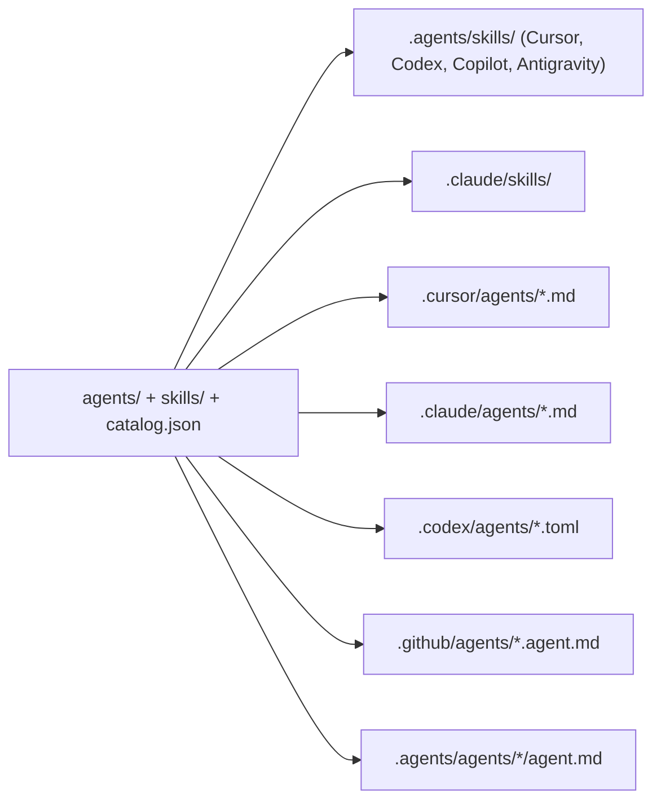

# Developer Docs

## Architecture

The shipped kit is small:

- CLI commands in `src/cli/index.ts` (`init`, `update`, `add`, `doctor`, `guide`, `adapter validate`, `package validate`)
- Install logic in `src/install/` (`install.ts`, `update.ts`, `prune-legacy.ts`, `doctor.ts`, `roster-adapters.ts`, `host-frontmatter.ts`, `ide-activate.ts`, `managed-assets.ts`, `adapter-validate.ts`, `add-agent.ts`, `add-skill.ts`)
- The contract in `catalog.json` (agents, skills, per-agent skill lists, fail-closed sentence, ask policy, spawn payloads) read through `src/catalog.ts`
- Canonical agents in `agents/<id>/agent.md` and skills in `skills/<id>/SKILL.md`, plus `templates/next-supabase/{AGENTS.md,CLAUDE.md,.cursor/rules/cursor-agent-kit.mdc}`, `USER_GUIDE.md`, `USER_GUIDE.html`

The CLI reads bundled assets from the package root so the same commands work in local development and after build.

### How the layers relate



`agents/` and `skills/` are the only sources. `roster-adapters.ts` rewrites frontmatter per host and never touches the body; `SPEC.md` lists what each host gets. The IDE reads the rendered copy, so four tests guard the pipeline: `rendered-drift` (rendered equals the current render, bodies equal canonical), `adapter-frontmatter` (each host's documented schema), `payloads` (handoff prompts and ask policy equal `catalog.json`), and `no-kit-content` (shipped files carry none of this repo's palette, HTML, or scan notes). `npm run dogfood:check` does the same for this repo's own installed copies and runs in `release:check`.

Ownership is single: `frontend-design` owns the visual fail list and the direction method; `deslop` owns word and structure tells; `browser-qa` owns screenshots; `accessibility-wcag` owns the keyboard pass; `testing-qa` owns commands; `ship` owns go/no-go. Agents point at the owning skill and do not restate its list.

Decisions are in `DECISIONS.md`; the 2026-09 scan notes that shaped the skills are in `research/summaries/`.

## Install Behavior

`agent-kit init --stack next-supabase` writes `AGENTS.md`, `USER_GUIDE.md`, `USER_GUIDE.html`, `.agent-kit/manifest.json`, `.agent-kit/config.json`, the Cursor rule, and `.agents/skills/`. Then, per activated host:

```bash
agent-kit init --activate cursor      # .cursor/agents/<id>.md (Planner readonly)
agent-kit init --activate claude      # .claude/agents/<id>.md (real tools, skills preloaded, effort), .claude/skills/, CLAUDE.md
agent-kit init --activate codex       # .codex/agents/<id>.toml (reasoning effort high for planner, security, design)
agent-kit init --activate copilot     # .github/agents/<id>.agent.md + .github/copilot-instructions.md
agent-kit init --activate antigravity # .agents/agents/<id>/agent.md (subagent: true, skills attached) + .agents/rules/agent-kit.md
agent-kit init --activate all
```

`agent-kit update` refreshes pristine files and regenerates activated layers; local edits win or land in `.agent-kit/conflicts/`. `agent-kit update --prune-legacy` is the only deleting path: it lists the 0.3 council leftovers and the 0.4 skill copies from the allowlist in `src/install/prune-legacy.ts`, asks for `y` (or `--yes`), deletes them, and regenerates what 0.5 owns. It never removes repo-root `skills/` inside the kit's own source tree.

`agent-kit add agent <id>` and `add skill <id>` render an optional entry to every host recorded in `.agent-kit/manifest.json` `activated`.

## Local Development

```bash
npm install
npm run dev -- doctor
npm test
npm run lint
npm run format
npm run build
```

### Maintainer dogfood

This repository installs its own kit. The rendered layers (`.cursor/agents`, `.claude/`, `.codex/`, `.agents/`, `.github/agents/`) are gitignored and regenerated; `.cursor/rules/cursor-agent-kit.mdc`, `CLAUDE.md`, and `.github/copilot-instructions.md` are tracked because a reader sees them on GitHub.

- Run `npm run dogfood:check` after editing anything under `agents/`, `skills/`, `catalog.json`, `templates/`, or `src/install/`. It regenerates every host layer with force (never the root docs, which are the kit's own), then fails if a tracked generated file changed, any rendered copy differs from the renderer's output, or `doctor` / `adapter validate all` fail. `release:check` runs it in CI.
- Root `AGENTS.md` here is the kit's own (it points maintainers at `DESIGN.md` and `MESSAGING.md`); downstream gets `templates/next-supabase/AGENTS.md`. Both carry the same ask policy and payloads, enforced by `tests/payloads.test.ts`.
- If `doctor` reports a council stub or a 0.4 skill copy, run `npx tsx src/cli/index.ts update --prune-legacy`; do not hand-edit around it.
- Release evidence is recorded in `DOGFOOD.md` and [MAINTAINER_RELEASE.md](MAINTAINER_RELEASE.md).

### Code quality tooling

- ESLint flat config (`eslint.config.js`, typescript-eslint recommended-type-checked) via `npm run lint`.
- Prettier via `npm run format` / `npm run format:check`.
- Vitest coverage gate (`vitest.config.ts`, v8 provider, thresholds 70/70/70/55) via `npm run test:coverage`.
- Changesets: run `npx changeset` with each user-visible change; the `Version` workflow opens a "Version Packages" PR. See `.changeset/README.md`.

## CI

GitHub Actions runs on pushes and pull requests to `main` across {ubuntu, windows, macos} × Node {20, 22, 24}. Each cell runs `npm ci`, `npm run release:check`, and `npm run smoke:audit-gate`. A separate Ubuntu job runs `npm run smoke:ui-screens` (Playwright captures of `USER_GUIDE.html` at 1280 and 390).

`release:check` validates JSON assets, checks version and changeset consistency, typechecks, lints, checks formatting, runs tests with the coverage gate, builds, validates the package and adapters, checks the example fixture, runs `dogfood:check`, install-smokes the packed tarball, runs the doctor gate, audits dependencies, validates the CycloneDX SBOM, and dry-runs `npm pack`. CI and the release workflow use the same command.

Node 20 stays in the matrix to prove the published `node >=20` engine contract.

## Repository Health

- `.github/ISSUE_TEMPLATE/*`, `.github/pull_request_template.md`, `.github/labels.yml`, `.github/labeler.yml` + `pr-labeler.yml`, `.github/CODEOWNERS`, `.github/dependabot.yml`.
- `.github/workflows/codeql.yml`, `dependency-review.yml`, `scorecard.yml`.
- `CODE_OF_CONDUCT.md`, `SUPPORT.md`, `GOVERNANCE.md`, `REPOSITORY_SETTINGS.md`, `SUPPLY_CHAIN.md`.

These files are covered by `tests/public-readiness.test.ts`. Dependency Review requires the GitHub dependency graph; enable it in repository security settings before weakening the gate.

## Delivery Tracking

`ROADMAP.md` holds only the open queue. History is in `DECISIONS.md` and `CHANGELOG.md`.

## Public NPM Release

Publishing targets `@appsforgood/next-supabase-kit` on the public npm registry through Trusted Publishing (provider GitHub Actions, repository `lukey662/agentsandskills`, workflow `release.yml`, environment `npm-publish`).

1. Merge the Version Packages PR so `package.json`, `package-lock.json`, and `CHANGELOG.md` agree.
2. Let CI pass on `main`.
3. Run the manual `Release` workflow with `dry_run=true` to validate without publishing.
4. Publish by pushing the version bump to `main` or dispatching `Release` with `dry_run=false`.
5. The workflow runs `release:check`, packs one tarball, generates and attests the SBOM, scrubs inherited npm token state, publishes with `--provenance`, verifies the published package with `scripts/post-publish-verify.mjs`, and creates the GitHub release.

Maintainers can rerun the public verification with `npm run publish:verify`. Do not use a bypass-2FA token for automation.

The optional LangGraph runtime (`@appsforgood/agent-kit-runtime`) is no longer in this repository. Its last source is at git tag `runtime-0.1.3`.
