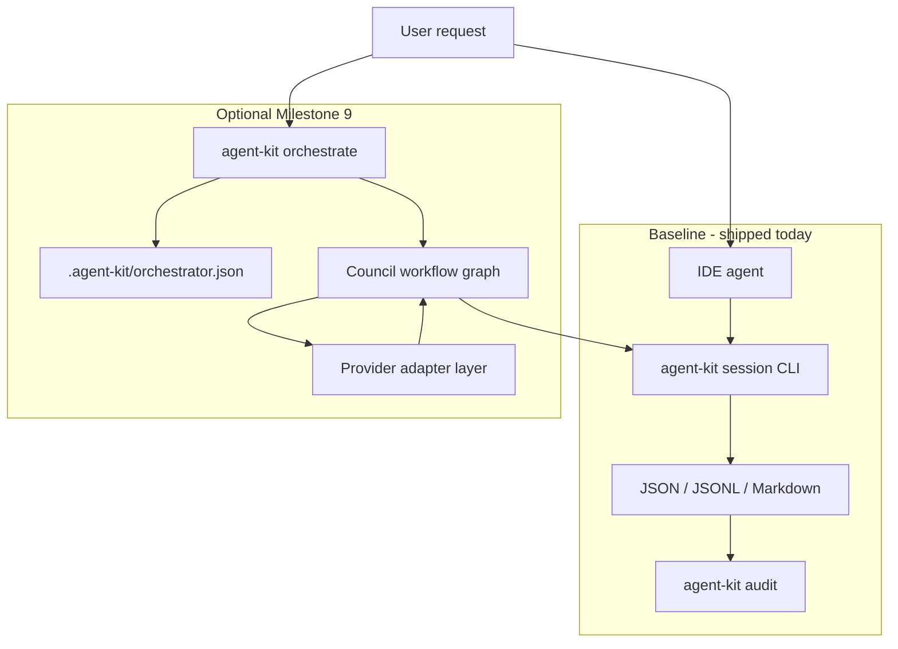

# Runtime Orchestration Scope (Milestone 9)

This document scopes optional direct AI orchestration for `@agent-skills/next-supabase-kit`. It does not change the baseline kit: IDE agents, local files, and CLI evidence remain the default path.

## Problem Statement

The kit already defines council agents, skills, handoffs, model routing, and Agent Studio session evidence. What it does not do today is spawn or coordinate LLM agents programmatically. Teams that want LangGraph, OpenAI Agents SDK, or similar execution need a provider-neutral bridge that reuses the existing file contracts instead of inventing a second state model.

## Goals

1. Keep baseline installs working without API keys, databases, daemons, or hosted services.
2. Reuse existing schemas: `agent-roster.json`, `session.json`, `events.jsonl`, correction rules, and audit gates.
3. Make orchestration opt-in through explicit local config and environment variables.
4. Preserve secret safety: no API keys, tokens, or customer data in session logs or rendered Markdown.
5. Allow future live Studio UI to render the same event stream without migration.

## Non-Goals

- Replacing IDE agents as the default actor.
- Requiring a specific model vendor or agent framework.
- Shipping autonomous multi-agent execution in v0.1.
- Building hosted multi-tenant orchestration in the first orchestration milestone.

## Proposed Architecture

## Deliverables

### 1. Orchestrator config contract

Add `schemas/orchestrator.schema.json` and `.agent-kit/orchestrator.json` with:

- `enabled`: boolean, default `false`
- `provider`: `openai-agents` | `langgraph` | `custom`
- `workflowBinding`: maps roster workflow IDs to graph entry nodes
- `agentBinding`: maps roster agent IDs to provider agent definitions
- `toolPolicy`: allowed tool classes, deny-by-default for network/file mutations unless explicitly enabled
- `budget`: optional token/cost ceilings per session
- `logging`: redaction profile and event sink (`events.jsonl` only in v1)

### 2. CLI surface

Add opt-in commands:

- `agent-kit orchestrate validate`
- `agent-kit orchestrate plan --workflow <id> --prompt <text>`
- `agent-kit orchestrate run --session <id> --workflow <id>`
- `agent-kit orchestrate status --session <id>`

Behavior:

- `plan` writes a proposed agent sequence and required outputs without calling a provider.
- `run` executes the workflow graph and appends the same event types the Studio CLI already uses: `decision`, `handoff`, `artifact`, `verify`, `required_output_updated`.
- `status` reads session files only; no background daemon required.

### 3. Provider adapter layer

Define a small internal interface:

- `loadAgent(agentId, roster, skills)`
- `executeStep(step, context, tools)`
- `emitHandoff(from, to, payload)`

Ship one reference adapter first (recommended: OpenAI Agents SDK or LangGraph.js) behind the interface. Additional providers should not require schema changes.

### 4. Security and OWASP alignment

- API keys only from env vars or local secret stores; never from repo files or session logs.
- Tool allowlists per workflow step; SSRF and path traversal guards on any filesystem/network tools.
- Human approval gate before destructive mutations (migrations, deploy commands, dependency upgrades).
- Rate limits and budget stop conditions surfaced as session events.
- Audit checks warn when orchestrator is enabled but tool policy or budget is missing.

### 5. Testing and release gates

- Unit tests for config validation, event mapping, and redaction.
- Integration test with mocked provider responses writing valid `events.jsonl`.
- Smoke test: `agent-kit orchestrate plan` on a temp install with zero network calls.
- Optional nightly job with real provider credentials in maintainer CI only.

## Integration Options

| Option | When to use | Tradeoff |
| --- | --- | --- |
| Stay IDE-only | Most teams today | Lowest ops complexity; enforcement remains advisory |
| Kit orchestrator on existing schemas | Need programmatic handoffs with audit trail | Medium build cost; preserves Git-native evidence |
| External framework + kit session CLI | Already standardized on LangGraph/OpenAI Agents | Fastest execution path; requires glue layer to map roster agents to graph nodes |

Recommended near-term path for teams needing runtime execution today:

1. Keep council routing and evidence in Agent Kit.
2. Map roster agents to nodes in LangGraph or OpenAI Agents SDK.
3. Persist handoffs through `agent-kit session handoff` and `agent-kit session render`.
4. Revisit built-in orchestration after two real projects prove the event protocol in production.

## Milestones

| Milestone | Scope | Estimate |
| --- | --- | --- |
| 9A | Orchestrator schema, validate command, plan-only mode | 3-5 days |
| 9B | Provider adapter interface + mocked execution tests | 4-6 days |
| 9C | First real provider adapter + budget/tool policy | 1-2 weeks |
| 9D | Live Studio controls over orchestrator commands | 1 week after 9C |

Total estimate after file protocol proof: **2-4 weeks** (matches [AGENT_STUDIO_PLAN.md](AGENT_STUDIO_PLAN.md)).

## Acceptance Criteria

- Baseline `agent-kit init`, session logging, audit, and Cursor adapter activation work with orchestrator disabled.
- Enabling orchestrator without valid config fails closed with actionable errors.
- A completed orchestrated session passes `agent-kit audit --min-readiness baseline-setup`.
- Session logs contain no secrets and validate against `session-event.schema.json`.
- Direct orchestration can be removed or disabled without breaking installed projects.

## Open Questions

1. Which provider adapter should ship first: OpenAI Agents SDK or LangGraph.js?
2. Should orchestrator runs require an explicit `--approve-tools` flag per session?
3. Do we need per-agent MCP server bindings in orchestrator config, or keep MCP activation IDE-side only?

## References

- [AGENT_STUDIO_PLAN.md](AGENT_STUDIO_PLAN.md) Milestone 9
- [DECISIONS.md](DECISIONS.md) 2026-06-07 Agent Studio local-first decision
- [schemas/studio-session.schema.json](schemas/studio-session.schema.json)
- [schemas/session-event.schema.json](schemas/session-event.schema.json)
- [research/summaries/agent-workflow-patterns.md](research/summaries/agent-workflow-patterns.md)
